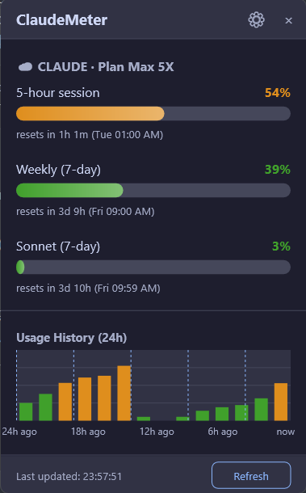
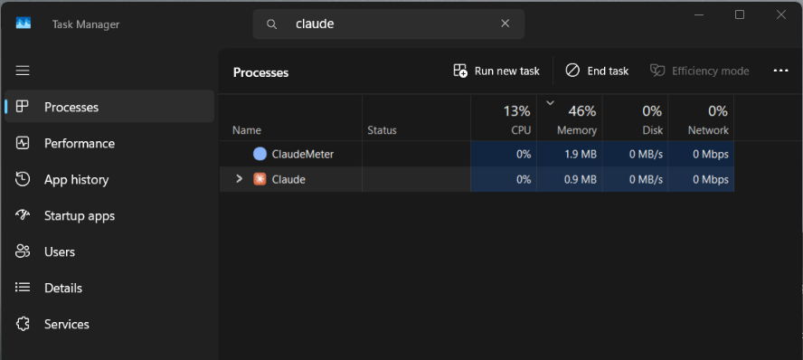
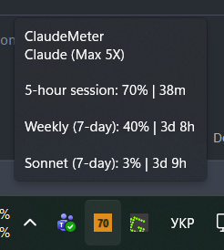
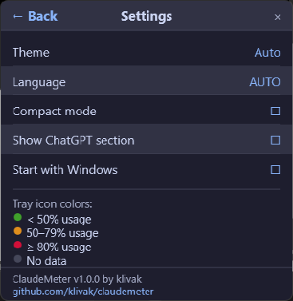

<div align="center">

# ⚡ ClaudeMeter

**Real-time Claude AI subscription usage monitor for Windows**

Ultra-lightweight system tray app built in Rust.
Track your Claude Pro/Max limits without opening a browser.

**🦀 Purposefully built in Rust — uses under 10 MB RAM. Less than Notepad.**

[](https://github.com/klivak/claudemeter/actions/workflows/build.yml)
[](https://github.com/klivak/claudemeter/actions/workflows/audit.yml)
[](https://github.com/klivak/claudemeter/releases/latest)
[](LICENSE)
[](https://github.com/klivak/claudemeter/releases)
[](#-why-rust)

[Download](#-quick-start) · [Features](#-features) · [Usage](#-how-to-use) · [FAQ](#-faq)

<br>



</div>

---

## 🤔 Why ClaudeMeter?

Tired of hitting Claude usage limits mid-conversation? ClaudeMeter sits quietly in your Windows system tray and shows you **exactly** how much quota you have left — 5-hour session, weekly limits, Sonnet and Opus caps — all without opening a browser tab.

## 🦀 Why Rust?

ClaudeMeter is **purposefully built in Rust** to be as lightweight as physically possible. While most similar tools use Electron (which bundles an entire Chromium browser) or Python (which needs a runtime), ClaudeMeter compiles to a single native Windows binary with zero dependencies.

| App | RAM Usage | Binary Size | Dependencies |
|-----|-----------|-------------|-------------|
| **ClaudeMeter (Rust)** | **~2 MB** | **~3 MB** | **None** |
| Windows Notepad | ~10 MB | built-in | — |
| Electron-based tray apps | 80–150 MB | ~80 MB | Chromium |
| Python-based monitors | 25–45 MB | ~15 MB | Python runtime |
| .NET-based monitors | 15–25 MB | ~1 MB | .NET runtime |



**Single portable `.exe`** — no installation, no runtime, no .NET, no Java, no Python, no Node.js. Download → run → done.

## ⬇ Quick Start

### Step 1: Install Claude Code (one-time)

ClaudeMeter reads your Claude credentials automatically. You need [Claude Code](https://claude.ai/download) installed and logged in:

```bash
# Install Claude Code (if not already)
# Download from https://claude.ai/download

# Log in (creates OAuth token that ClaudeMeter will use)
claude
```

### Step 2: Download & Run ClaudeMeter

1. **Download** [`claudemeter.exe`](https://github.com/klivak/claudemeter/releases/latest) from Releases
2. **Place** it anywhere — Desktop, tools folder, USB drive (it's portable)
3. **Double-click** to run
4. **Look** for the colored circle icon in your system tray (bottom-right near the clock)

That's it! No configuration needed. ClaudeMeter auto-detects your plan and starts monitoring.

### Step 3 (Optional): Enable Auto-Start

Right-click the tray icon → check ✅ **"Start with Windows"**

## ✨ Features

### Claude AI Monitoring (Automatic)

| Metric | Description |
|--------|-------------|
| 5-hour session | Rolling session utilization with countdown timer |
| 7-day weekly | Weekly usage cap with reset timer |
| 7-day Sonnet | Sonnet-specific limit (shown if applicable) |
| 7-day Opus | Opus-specific limit (Max plans only) |
| Plan detection | Automatically detects Pro vs Max (incl. 5x/20x tiers) |
| Future metrics | Any new API fields are auto-displayed |

### ChatGPT / Codex (Optional)

OpenAI does not provide a public API for checking ChatGPT Plus/Pro subscription usage. ClaudeMeter includes an optional panel (disabled by default) with a direct link to your ChatGPT usage page. Enable it in Settings if you want quick access.

### System Tray

- **🔢 Dynamic % icon** — shows actual utilization number (e.g. "42") with color-coded background
- **🟢🟡🔴 Color coding** — green (<50%), yellow (50-79%), red (>=80%), gray (no data)
- **💬 Rich tooltip** — hover to see all metrics, reset times, and plan info
- **📋 Context menu** — right-click for refresh, export CSV, settings, links
- **📊 Dashboard** — left-click to open the detailed popup
- **⚠ Blink on critical** — tray icon blinks when usage exceeds 90%



### 📊 Dashboard

- **Gradient progress bars** — smooth color gradients for each metric
- **Animated bars** — bars fill smoothly on popup open (~60fps)
- **Fade-in animation** — popup appears with smooth opacity transition
- **24-hour usage chart** — with session reset lines and hover tooltips
- **Chart hover** — hover any bar to see exact % and time
- **Keyboard shortcuts** — ESC to close, F5 to refresh
- **Auto-refresh** — automatically polls when data is older than 60 seconds
- **Mica backdrop** — Windows 11 translucent effect (falls back gracefully on Win10)

### 🎨 Themes

- **Dark** — easy on the eyes (Catppuccin Mocha palette)
- **Light** — for bright environments (Catppuccin Latte palette)
- **Auto** (default) — follows your Windows system theme automatically



### 🌐 Languages

- 🇬🇧 English (default)
- 🇺🇦 Українська
- 🇪🇸 Español
- 🇩🇪 Deutsch
- 🇫🇷 Français

### 🔔 Smart Notifications

- Windows toast notifications at configurable thresholds (50%, 75%, 90% by default)
- **Informative alerts** — shows metric name, current %, exceeded threshold, and reset countdown
- **Sound alerts** — system notification sound (configurable on/off)
- **Startup notification** — confirmation that ClaudeMeter is running in the tray
- **Deduplication** — won't spam; resets when usage drops below threshold

### 📤 Data Export

- **CSV export** — right-click tray → "Export History (CSV)" to save full usage history
- **SQLite database** — 30-day rolling history stored next to the .exe

### ⚙ Smart Polling

- **Idle detection** — pauses API polling when PC is idle for 5+ minutes
- **Exponential backoff** — on API errors, interval doubles (2x, 4x, 8x) up to 10 min cap
- **Rate-limit handling** — graceful 429 response parsing with retry-after
- **Config validation** — sanitizes all values on load (polling interval 30-600s, thresholds 1-100%)

## ⚙ Configuration

`config.json` is auto-created next to the `.exe` on first launch:

```json
{
  "version": "1.0.0",
  "polling_interval_seconds": 120,
  "notifications": {
    "enabled": true,
    "thresholds": [50, 75, 90],
    "sound": true
  },
  "autostart": false,
  "compact_mode": false,
  "theme": "auto",
  "language": "auto",
  "show_chatgpt_section": false
}
```

| Field | Default | Range | Description |
|-------|---------|-------|-------------|
| `polling_interval_seconds` | `120` | 30–600 | How often to check usage (validated on load) |
| `notifications.enabled` | `true` | — | Enable/disable toast notifications |
| `notifications.thresholds` | `[50,75,90]` | 1–100 | Usage % levels that trigger alerts |
| `notifications.sound` | `true` | — | Play system sound with notifications |
| `theme` | `"auto"` | auto/dark/light | Color theme |
| `language` | `"auto"` | auto/en/uk/es/de/fr | UI language |
| `compact_mode` | `false` | — | Compact dashboard layout |
| `show_chatgpt_section` | `false` | — | Show ChatGPT quick-link panel |
| `autostart` | `false` | — | Start with Windows |

## ⌨ Keyboard Shortcuts

| Key | Action |
|-----|--------|
| **ESC** | Close dashboard popup |
| **F5** | Refresh usage data |

## 🔨 Building from Source

```bash
git clone https://github.com/klivak/claudemeter.git
cd claudemeter
cargo build --release
# Output: target/release/claudemeter.exe (~3 MB)
```

**Requirements:** Rust 1.75+ and Windows SDK (included with [Visual Studio Build Tools](https://visualstudio.microsoft.com/visual-cpp-build-tools/)).

## 🔑 How Authentication Works

ClaudeMeter does **not** ask for your password or API key. It reuses the OAuth token that [Claude Code](https://claude.ai/download) already stores on your machine.

**Token lookup order:**

| # | Location | Used by |
|---|----------|---------|
| 1 | `~/.claude/.credentials.json` | Claude Code v2.x+ |
| 2 | Windows Credential Manager (`Claude Code-credentials`) | Claude Code v1.x (legacy) |

When you run `claude` and log in via the browser, Claude Code saves an OAuth token to `~/.claude/.credentials.json`. ClaudeMeter reads this file to authenticate with the Anthropic Usage API — no extra setup needed.

**What's stored in the file:**

```json
{
  "claudeAiOauth": {
    "accessToken": "sk-ant-oat01-...",
    "refreshToken": "sk-ant-ort01-...",
    "expiresAt": 1772467364905,
    "subscriptionType": "max"
  }
}
```

ClaudeMeter uses `accessToken` to fetch your usage data and `subscriptionType` to display your plan (Pro/Max). It never modifies this file.

> **Troubleshooting:** If ClaudeMeter shows "Credentials not found", run `claude` in a terminal and log in. Then click Refresh in ClaudeMeter.

## ❓ FAQ

**Q: Does it work without Claude Code installed?**
A: ClaudeMeter launches but shows a "Credentials not found" message with a link to claude.ai. You need Claude Code logged in so ClaudeMeter can read the OAuth token from `~/.claude/.credentials.json`.

**Q: How much RAM does it really use?**
A: Typically **3–8 MB**. Built in Rust with native Win32 API — no Electron, no browser engine.

**Q: Is it safe? Does it send my data anywhere?**
A: ClaudeMeter is fully open source. It only communicates with `api.anthropic.com` to fetch YOUR usage data using YOUR existing OAuth token. Zero telemetry.

**Q: Why isn't ChatGPT tracking automatic?**
A: OpenAI deliberately does not expose ChatGPT subscription usage via any public API.

## 📄 License

[MIT](LICENSE) — free for personal and commercial use.

---

<div align="center">

**🦀 Purposefully built in Rust for minimal footprint and maximum reliability**
**3–8 MB RAM · Single .exe · Zero dependencies · Open source**

Made by [klivak](https://github.com/klivak)

*Claude is a trademark of Anthropic. ChatGPT is a trademark of OpenAI.*
*ClaudeMeter is an independent open-source project with no official affiliation.*

</div>

<!-- SEO keywords: claude usage monitor, claude ai usage tracker, claude limits monitor windows, claude pro usage limits tracker, claude max usage monitor, anthropic claude usage, claude code usage monitor windows, claude subscription limits, claude tray app windows, rust windows tray application -->
